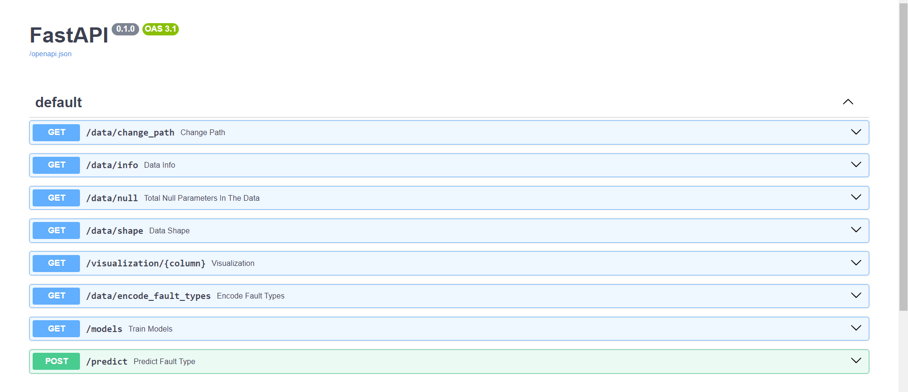
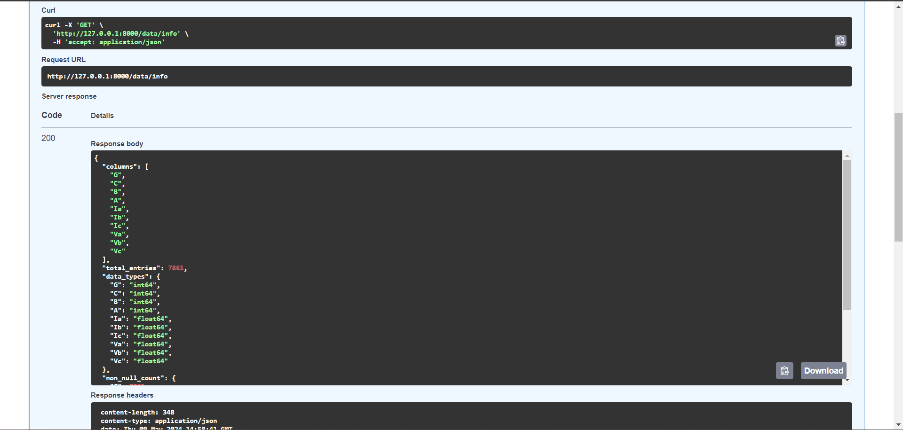
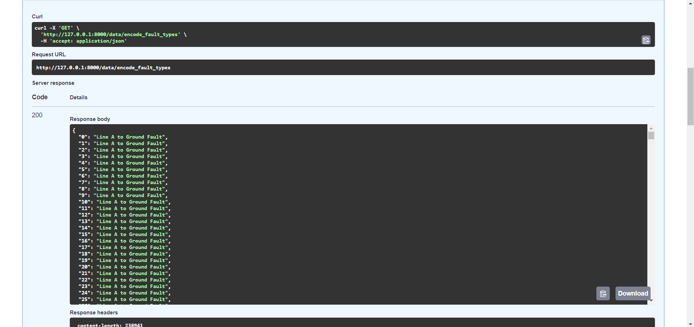
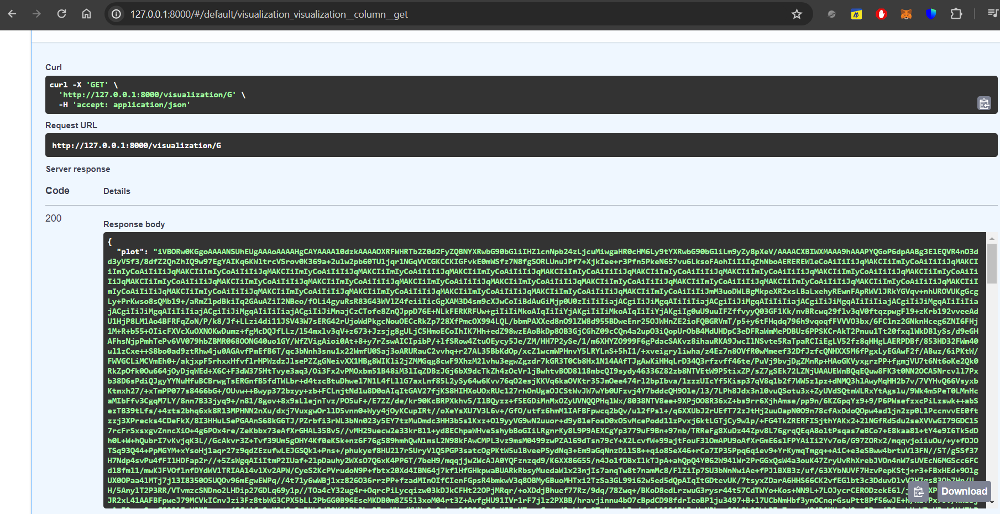
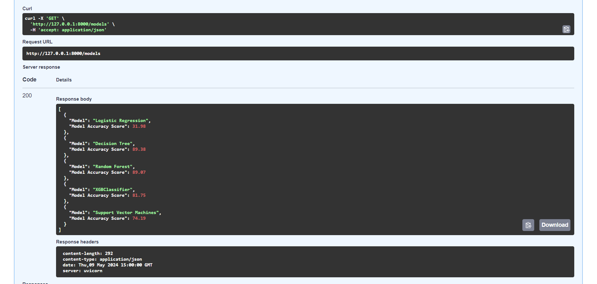
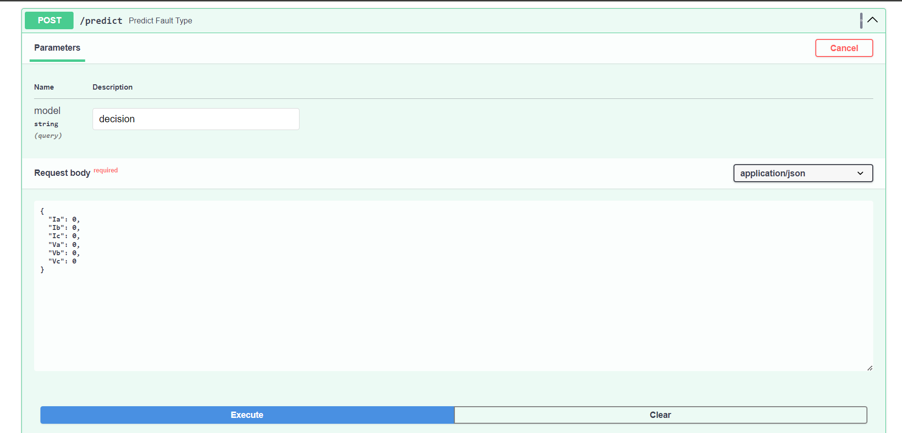

# 🚨 Fault Detection API

The Fault Detection API is a FastAPI-based web service for predicting faults in electrical systems using machine learning models. It provides endpoints for visualizing data, training machine learning models, and predicting faults based on sensor readings.

## 🚀 Installation

To install the required dependencies, run:

```bash
pip install -r requirements.txt
```

## 🌱Usage

### Starting the API server

To start the API server, run the following command:

```bash
uvicorn main:app --reload
```

This will start the server locally, and you can access the API documentation at `http://127.0.0.1:8000`.

### Endpoints
#### Change Data Paths

- **GET /data/change_path**: Endpoint to change the path of the data file. If no path is provided, there is already a default dataset to take care of it (from Kaggel)
  - Parameters:
    - `path`: New path of the data file.

#### Data Info

- **GET /data/info**: Endpoint to visualize data.
- **GET /data/shape**: Shape of the data
- **GET /data/null**: Total null parameters in dataset

#### Visualize Data

- **GET /visualization**: Endpoint to visualize data.

#### Train Models

- **GET /models**: Endpoint to train machine learning models and evaluate their accuracy.

## Example Usage

### Visualize Data

```bash
curl -X 'GET' \
  'http://127.0.0.1:8000/visualization' \
  -H 'accept: application/json'
```

### Train Models

```bash
curl -X 'GET' \
  'http://127.0.0.1:8000/models' \
  -H 'accept: application/json'
```

### Change Data Path

```bash
curl -X 'GET' \
  'http://127.0.0.1:8000/data/change_path?path=new_data_path.csv' \
  -H 'accept: application/json'
```




 (Provides the base-64 of image which can be converted to image in frontend)


